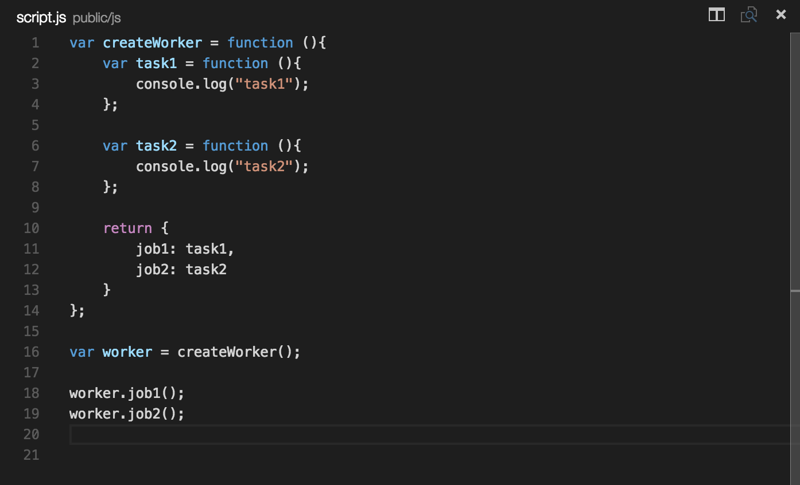

#Introduction to Angular JS

#In this directory you find an intro to 
- Controllers
- Directives and Views 
- Services
- Routing

** Entire app is run through app.js on the root level by typing node app.js in a command prompt

# Javascript Patterns to be aware of

# Functions as Abstractions
- Purpose is to abstract away some sort of operation that needs to be performed
    - we do this by creating a work function and then assign it to a variable called work 
    - see image below 
    

# Functions to Build Modules
- Allows us to create objects that have data and methods attached to it
    - Can be seen from the client perspective
        - Someone who is going to use an object that exposes methods and data
    - see image below 
    